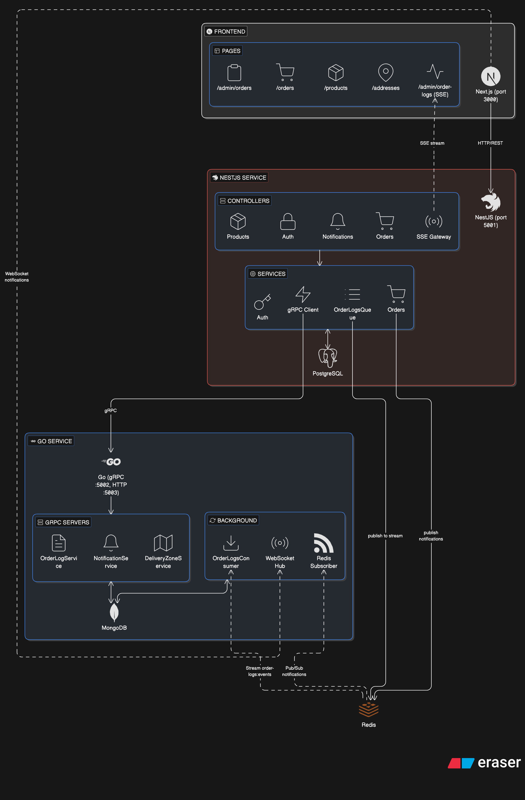

# Shoptik – Distributed E-Commerce Platform

<p align="center">
  
</p>

---

## What is Shoptik?

Shoptik is a **production-ready distributed e-commerce platform** that
demonstrates real-world microservices architecture patterns. It combines
multiple technologies to deliver a scalable, real-time shopping experience with
comprehensive audit logging.

Built with **Next.js**, **NestJS**, and **Go**, Shoptik showcases:

- gRPC for high-performance inter-service communication
- Redis Streams for asynchronous event processing
- Server-Sent Events (SSE) for real-time admin dashboards
- WebSocket for live user notifications
- Polyglot persistence (PostgreSQL + MongoDB + Redis)

---

## Why This Project?

Modern e-commerce platforms require:

| Requirement                          | Solution in Shoptik                           |
| ------------------------------------ | --------------------------------------------- |
| Handle thousands of concurrent users | Microservices that scale independently        |
| Process orders asynchronously        | Redis Streams with batch processing           |
| Real-time notifications              | WebSocket + Redis Pub/Sub                     |
| Admin audit trail                    | SSE streaming from MongoDB                    |
| Fast API responses                   | gRPC binary serialization                     |
| Data consistency                     | PostgreSQL (relational) + MongoDB (documents) |

Shoptik provides **production-ready examples** for all these patterns.

---

## Architecture Overview

```
┌─────────────────────────────────────────────────────────────────────────┐
│                           Frontend (Next.js)                             │
│                       http://localhost:3000                              │
│  ┌──────────────────┐  ┌──────────────────┐  ┌──────────────────────┐  │
│  │  User Dashboard  │  │  Admin Portal    │  │  Notifications Hook  │  │
│  │  - Products      │  │  - Order Logs    │  │  - Real-time updates │  │
│  │  - Cart         │  │  - Products CRUD │  │  - WebSocket client  │  │
│  │  - Orders       │  │  - Order Mgmt    │  │                      │  │
│  └────────┬─────────┘  └────────┬─────────┘  └──────────┬───────────┘  │
└───────────┼─────────────────────┼──────────────────────┼──────────────┘
            │                     │                      │ WebSocket
            │ REST                 │ SSE                  │
            ▼                     ▼                      ▼
┌───────────────────────────────────────────────────────────────────────────┐
│                          NestJS Service                                 │
│                      http://localhost:5001                              │
│                                                                           │
│  ┌─────────────┐  ┌─────────────┐  ┌─────────────┐  ┌───────────────┐  │
│  │ Auth API    │  │ Orders API  │  │ Products    │  │ SSE Gateway  │  │
│  │ /auth/*     │  │ /orders/*   │  │ /products/* │  │ /sse/order-  │  │
│  │             │  │             │  │             │  │ logs         │  │
│  └──────┬──────┘  └──────┬──────┘  └──────┬──────┘  └──────┬───────┘  │
│         │                │                │                │           │
│         └────────────────┴────────┬───────┴────────────────┘           │
│                                   │                                     │
│         ┌─────────────────────────┼─────────────────────────────────┐  │
│         │  Redis                  │                                   │  │
│         │  ┌───────────┐  ┌────────▼────────┐  ┌──────────────────┐  │  │
│         │  │ Pub/Sub  │  │ Redis Stream   │  │ gRPC Client       │  │  │
│         │  │notify:* │  │ order-logs:evt │  │ → Go Service      │  │  │
│         │  └────┬────┘  └───────┬────────┘  └────────┬─────────┘  │  │
│         └──────┼───────────────┼──────────────────────┼───────────┘  │
└────────────────┼───────────────┼──────────────────────┼──────────────┘
                 │               │                      │ gRPC
                 ▼               ▼                      ▼
┌───────────────────────────────────────────────────────────────────────────┐
│                            Go Service                                     │
│              HTTP:5002          │          gRPC:5003                     │
│                                                                           │
│  ┌──────────────────────┐  ┌──────────────────────┐  ┌─────────────┐  │
│  │  WebSocket Hub       │  │  gRPC Servers         │  │  HTTP API   │  │
│  │  /ws endpoint        │  │  - DeliveryZone       │  │  /health    │  │
│  │                      │  │  - Notification       │  │  /health/db │  │
│  │  Routes by userId    │  │  - OrderLog           │  │             │  │
│  └──────────┬───────────┘  └──────────────────────┘  └─────────────┘  │
│             │                                                           │
│  ┌──────────┴───────────┐  ┌──────────────────────┐                    │
│  │  Redis Subscriber   │  │  Stream Consumer     │                    │
│  │  (Pub/Sub listener) │  │  (XREAD from stream) │                    │
│  └──────────┬───────────┘  └──────────┬───────────┘                    │
└─────────────┼─────────────────────────┼────────────────────────────────┘
              │                         │
              ▼                         ▼
┌─────────────────────────┐    ┌──────────────────────────────────────────┐
│   MongoDB               │    │  Redis                                  │
│  ┌──────────────────┐  │    │  ┌────────────────────────────────────┐  │
│  │ notifications     │  │    │  │ Pub/Sub channels                  │  │
│  │ order_logs        │  │    │  │  - notifications:user:{id}         │  │
│  │ delivery_zones   │  │    │  │  - notifications:admin              │  │
│  └──────────────────┘  │    │  │ Streams                            │  │
└─────────────────────────┘    │  │  - order-logs:events               │  │
                                │  └────────────────────────────────────┘  │
                                └──────────────────────────────────────────┘
```

---

## Key Features

### User Features

- **Product Catalog** – Browse, search, filter products
- **Shopping Cart** – Persistent cart with stock validation
- **Address Management** – Multiple addresses with pincode delivery validation
- **Order Placement** – Full order lifecycle with payment simulation
- **Real-time Notifications** – WebSocket-powered order updates

### Admin Features

- **Product Management** – Full CRUD with stock control
- **Order Management** – View, update status, process refunds
- **Delivery Zones** – Configure pincode-based delivery (ETA, charges)
- **Order Logs Terminal** – Real-time SSE stream of all order events
- **Notification Management** – View and manage user notifications

---

## Technology Stack

| Layer            | Technology      | Purpose                     |
| ---------------- | --------------- | --------------------------- |
| Frontend         | Next.js 14      | React UI with App Router    |
| API Gateway      | NestJS          | REST API, SSE, gRPC client  |
| Backend Services | Go              | gRPC servers, WebSocket hub |
| SQL Database     | PostgreSQL      | Users, products, orders     |
| Document DB      | MongoDB         | Logs, notifications         |
| Message Queue    | Redis           | Pub/Sub, Streams            |
| Real-time        | WebSocket + SSE | Live notifications & logs   |

---

## Getting Started

### Prerequisites

- Node.js 18+
- Go 1.21+
- Docker & Docker Compose
- pnpm

### Quick Start

```bash
# 1. Clone and install dependencies
git clone https://github.com/CoderSwarup/shoptik.git
cd shoptik
pnpm install

# 2. Start infrastructure (PostgreSQL, MongoDB, Redis)
pnpm docker:start

# 3. Start all services
pnpm dev

# 4. Open browser
# Frontend: http://localhost:3000
# API: http://localhost:5001
```

---

## Project Structure

```
shoptik/
├── apps/
│   ├── web/                 # Next.js frontend
│   │   ├── app/             # App router pages
│   │   │   ├── admin/       # Admin dashboard pages
│   │   │   └── ...          # User pages
│   │   ├── components/      # React components
│   │   └── services/        # API service clients
│   │
│   ├── nestjs-service/      # NestJS API service
│   │   └── src/
│   │       ├── orders/      # Order management
│   │       ├── products/    # Product catalog
│   │       ├── notifications/ # Notification service
│   │       ├── order-logs/  # SSE streaming
│   │       └── grpc/        # gRPC client
│   │
│   └── go-service/          # Go microservice
│       ├── cmd/server/      # Entry point
│       ├── internal/
│       │   ├── handler/     # HTTP handlers
│       │   ├── service/     # Business logic
│       │   ├── model/       # Data models
│       │   └── repository/  # MongoDB operations
│       └── pkg/proto/       # Generated protobuf
│
├── packages/
│   └── proto/               # Shared .proto definitions
│
├── docker/
│   └── docker-compose.yml       # Docker services
```

---

## Data Flows

### Order Event Logging

```
┌──────────────┐    ┌──────────────┐    ┌──────────────┐
│   User       │    │   NestJS     │    │   Redis      │
│  places      │───▶│  Service     │───▶│  Stream      │
│  order       │    │              │    │  (XADD)      │
└──────────────┘    └──────────────┘    └──────┬───────┘
                                               │
                                               ▼
┌──────────────┐    ┌──────────────┐    ┌──────────────┐
│   Admin      │◀───│   NestJS     │◀───│     Go       │
│  Dashboard   │    │  SSE         │    │  Consumer    │
│  (SSE)       │    │              │    │  (XREAD)     │
└──────────────┘    └──────────────┘    └──────┬───────┘
                                               │
                                               ▼
                                        ┌──────────────┐
                                        │   MongoDB    │
                                        │  (batch      │
                                        │   insert)    │
                                        └──────────────┘
```

### Real-time Notifications

```
┌──────────────┐    ┌──────────────┐    ┌──────────────┐
│   Order      │    │   NestJS     │    │   Redis      │
│  event       │───▶│  Service     │───▶│  Pub/Sub     │
│              │    │              │    │              │
└──────────────┘    └──────┬───────┘    └──────┬───────┘
                          │                   │
                          ▼                   ▼
                 ┌──────────────┐    ┌──────────────┐
                 │  MongoDB     │    │     Go       │
                 │  (store)    │    │  Subscriber  │
                 │              │───▶│  (broadcast) │
                 └──────────────┘    └──────┬───────┘
                                           │
                                           ▼
                                  ┌──────────────┐
                                  │   Browser    │
                                  │  (WebSocket) │
                                  └──────────────┘
```

---

## API Endpoints

### NestJS Service (Port 5001)

| Endpoint             | Method   | Description        |
| -------------------- | -------- | ------------------ |
| `/auth/register`     | POST     | Register new user  |
| `/auth/login`        | POST     | User login         |
| `/products`          | GET      | List products      |
| `/orders`            | GET/POST | List/create orders |
| `/orders/:id/pay`    | POST     | Process payment    |
| `/addresses`         | CRUD     | Address management |
| `/notifications`     | GET      | User notifications |
| `/order-logs/recent` | GET      | Recent order logs  |
| `/sse/order-logs`    | GET      | SSE stream         |
| `/delivery-zones`    | CRUD     | Delivery zones     |

### Go Service (Ports 5002/5003)

| Endpoint              | Protocol  | Description             |
| --------------------- | --------- | ----------------------- |
| `/health`             | HTTP      | Service health          |
| `/health/db`          | HTTP      | Database health         |
| `/ws`                 | WebSocket | Real-time notifications |
| `DeliveryZoneService` | gRPC      | Delivery zone CRUD      |
| `NotificationService` | gRPC      | Notification CRUD       |
| `OrderLogService`     | gRPC      | Order log queries       |

---

## Production Considerations

This codebase demonstrates **production-ready patterns**:

✅ **Error Handling** – All services include proper error handling and logging\
✅ **Graceful Shutdown** – Servers handle SIGTERM for zero-downtime deploys\
✅ **Connection Recovery** – Redis cursor tracking prevents duplicate
processing\
✅ **Batch Processing** – Efficient MongoDB inserts (50 docs or 2s)\
✅ **Type Safety** – gRPC protobuf contracts between services\
✅ **CORS Configuration** – Proper cross-origin setup\
✅ **Security** – JWT authentication, role-based access

---

## Development Scripts

```bash
# Start all services in development
pnpm dev

# Start infrastructure only
pnpm docker:start

# Build all applications
pnpm build

# View container logs
pnpm docker:logs

# Stop all services
pnpm docker:stop
```

---

## License

MIT

---

## Contributing

Contributions welcome! This is a learning project designed to demonstrate
distributed systems patterns. Feel free to open issues or submit PRs.

---

## Summary

Shoptik is more than an e-commerce app — it's a **comprehensive reference
implementation** for building:

- Microservices with polyglot backends
- Real-time web applications
- Event-driven architectures
- gRPC-based systems
- Production-ready patterns

Perfect for developers learning distributed systems or building similar
platforms.

---

<p align="center">
  <a href="https://github.com/CoderSwarup/shoptik">
    
  </a>
</p>

<p align="center">
  <strong>Happy Coding! 🚀</strong>
</p>
